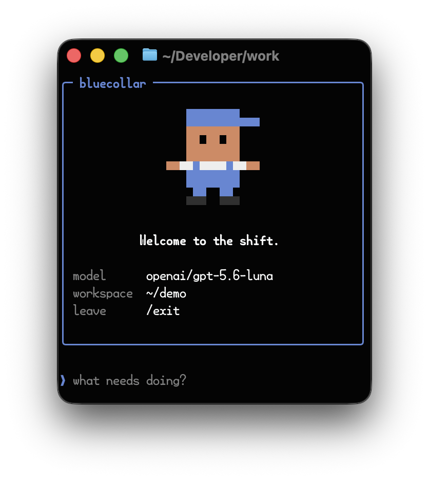
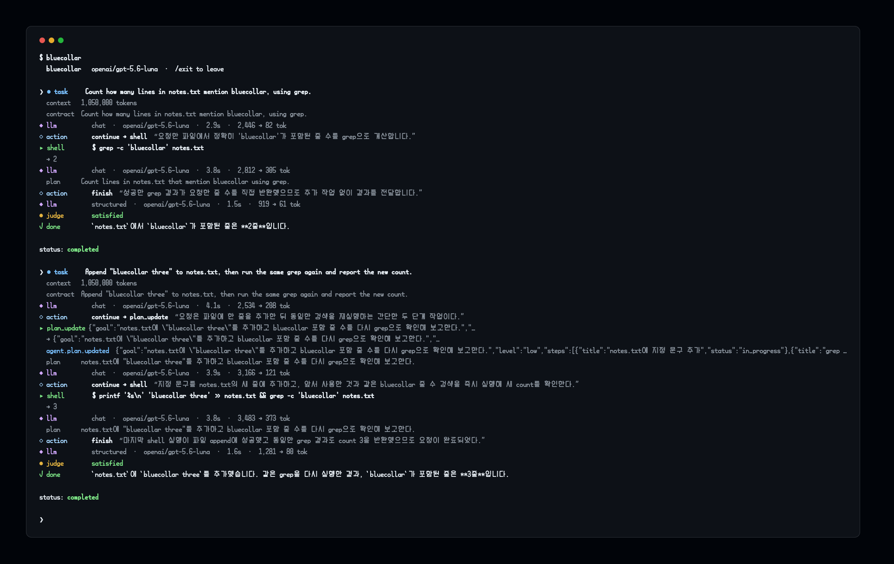

# bluecollar

*An agent harness that does the work, keeps a record, and tells you when it can't.*

[](https://github.com/yeomyeonggeori/bluecollar/actions/workflows/check.yml)
[](https://pkg.go.dev/github.com/yeomyeonggeori/bluecollar)
[](go.mod)
[](LICENSE)



> **Status: pre-alpha, under active development.** The exported API, the
> contract types and the event names all still change without notice, and there
> is no release, no versioning policy and no migration path between commits. It
> is published so the design can be read and argued with, not so it can be
> depended on. If you import it, pin a commit and expect to read diffs.

bluecollar is a headless, embeddable agent harness for unattended work: the loop that takes a
request, decides what to do, calls tools, and answers.

The name is the design. This loop works the way a good tradesperson works: it takes the job, does
it, and answers to whoever asked. It can prove what it finished, because every step went into a
ledger as it happened. When it cannot finish, it says so, to the person who asked, in their
language, with what it tried. And when a job would cost more than it is worth, it puts the tools
down and says that too, instead of looking busy for another hour on someone else's money.

It owns no tools, no identity and no storage. A host hands it a tool set and a task store and it
runs the turn, so the same loop runs behind a chat connector on a server or in a terminal in front
of you.

It is built for work nobody is watching. A request arrives from someone else, the person who sent it
goes back to their day, and the answer has to be right without anyone checking, or the failure has
to be reported like one. So the loop carries what an interactive coding agent has no use for:

- an outcome contract agreed before work starts
- a completion gate that will not take the model's word that it is done
- a clock derived from what a step measurably costs, so a slow model gets a longer shift and a
  hopeless task gets a plain stop
- approval as a state a task can sit in for days and resume from
- a plan step that sizes the task, picks the tier, and settles which tools stand in front of the
  model for the length of that step
- failure text written for the person who asked, not for a log

It is heavier than an interactive loop. For sitting beside a developer and fixing code as they
watch, a coding agent is the better tool, and it will not pretend otherwise.

## The model's kernel

The model's kernel is `read`, `write`, `edit`, `bash`, `plan` and `equip`. The
first four are the work. `plan` records the goal, its steps and the task's `level`, which is what
sizes the run. `equip` takes a sentence describing a need and answers with the tools that serve
it. The names are constants in [`toolcontract`](./toolcontract/kernel_tools.go) and the descriptors
behind them belong to the host, so a host with a CRM or a calendar publishes those as ordinary tools
and the kernel stays this size.

Alongside the kernel, the model has three ways to end a step: `continue` calls one of its tools,
`fail` reports a blocker, and `reply` speaks.

**A reply is the model's one way to say anything.** It carries words and any files it attaches;
`final` makes it the last word on the task, `expectsAnswer` makes it a question the run pauses
on, and `choices` turns that question into buttons where the messenger draws them. Attachments and questions still go through `file_deliver` and `ask_input`, which stay registered
as internal tools the runtime invokes behind the reply
([`loop/reply_action.go`](./loop/reply_action.go)), so both leave a tool observation in the ledger
and the completion gate reads them as it always did. `finish`, `ask_input`, `file_deliver`,
`request_tools` and `plan_update` are gone from the model's vocabulary.

**The tool set is settled once per plan step.** A step change re-selects a shortlist capped at
`toolcontract.ToolNamesOnePlanStepIsExpectedToNeed`, and every iteration inside one step sends a
byte-identical system instruction, tool catalog and unchanging context
([`loop/step_tool_selection_test.go`](./loop/step_tool_selection_test.go) asserts the bytes). The
system instruction is frozen at the start of the run. Elapsed-time narrowing still happens per
iteration, by design.

**`equip` is how the model reaches past the kernel.** It answers a described need through the
same selector intake uses to pick a turn's likely tools, `agentcontract.ToolSelector` as implemented
by [`intake.DecisionPlanner`](./intake/tool_selection_call.go), and the tools it names are pinned
for the next turn. A catalog too large for one decision request is split into byte-balanced batches
that never ask about a tool twice.

## The shape

```
host  ──── agentcontract.Harness ────  bluecollar
  │                                        │
  │ owns: tools, identity, task store,     │ owns: the turn loop, skills,
  │       routing, approvals, isolation    │       completion judgment
  │                                        │
  └──────── executes every tool call ──────┘
```

The host and the harness compile against one shared contract package,
[`agentcontract`](./agentcontract). A different harness, an AI SDK adapter or an external agent,
drops into the same socket. The loop itself is [`loop`](./loop); the root of the
repository holds the contract packages, the commands, and nothing else.

The port is one method:

```go
type Harness interface {
	RunTurn(context.Context, AgentTurnRequest) (AgentTurnResult, error)
}
```

It used to be nine. Routing, addressing, follow-up classification and one-shot replies were verbs on
the port until it became clear where they belong: a host that answers its own messenger decides
what an inbound message *means* before anything runs a turn, so the decision is its. Those still
live here — [`intake.TurnRouter`](./intake/turn_router.go) routes a message and
`intake.DecisionPlanner` answers every closed question about it, `AgentKernel` carries
`RunAgentRequest` and `CompleteLaunchFailure` — but a host is free to bring its own, and a harness
that implements only `RunTurn` is complete.

Tool execution never happens here. The harness decides *what* to call; the host decides *who* it runs
as. A harness that runs its own tools defeats the host's isolation boundary and is not a valid
implementation of this contract.

The harness has no identity of its own. The host supplies `AgentIdentity`, the workspace layout, the
instruction bundle and the company context; with none given, the agent is "the assistant" and knows
nothing about where it runs.

Delegation is the loop's, for the same reason. A `delegate` action hands one self-contained piece
of a task to a fresh turn carrying the same identity and the same tool set, with its own outcome
contract and completion gate, and reports back as an observation. The host still executes every tool
call, so a child reaches nothing its parent could not. It is off unless a host sets
`TurnOptions.DelegationLimit`, and off costs a turn nothing: no action variant, no paragraph.

## The machinery

Each of the bullets in the opening list is a mechanism with a sharp edge. This section is for
reading them the way an engineer reads them.

**Completion is proven, never claimed.** A reply marked `final` starts an argument instead of ending
the turn. A deterministic gate checks the recorded facts first: every tool the outcome contract
requires has a successful call in the ledger, side-effect evidence exists where the contract demands
it, promised artifacts validate. Only a turn that passes the gate reaches the completion judge: a
second model call that reads the ledger, expands the observations the reply cites as evidence, and
can reject with reasons the loop must answer. Rejections are remembered across attempts, so a turn
cannot farm the judge by sending one final reply after another until the dice land well. When the judge itself is
unavailable, the event says so; the loop degrades loudly and in writing.

**The clock is measured, and it follows the model.** Every iteration's wall time is sampled per
model; the task budget is the tier's step count times the measured median times a margin. The
floor and the cap are per-step plausibility bounds, so both scale with the tier's step count
instead of sitting at a fixed number of minutes. A slow model gets a longer shift because the
arithmetic says so. Budgets refresh monotonically as samples accumulate, a
raised wall re-derives the working context's deadline, and the single free tier escalation fires
from whichever limit arrives first (step overflow, the elapsed wall, or a deadline that expires
mid-call) and spends exactly once. A wall the host set explicitly is the host's number and is
never escalated away.

A host can mark `ExecutionStartedAt` after its bounded routing phase. The execution
budget starts there, while the caller's deadline still caps the run. Restart recovery
keeps its existing clock. Intake stops retain the expected outcome and report the
planned interpretation separately from recorded execution and earlier results.

**A stalled model call is cut at the measured patience and asked again.** The same per-model latency
samples that size the budget also size how long one call is worth waiting for. A call that passes
that mark is cancelled and reissued on the caller's own deadline, and the ledger records that it was
cut. Intake calls carry the same discipline as the loop's
([`intake/model_call_patience.go`](./intake/model_call_patience.go)). A caller cancelling the turn is
never a cut and is never retried.

**Progress is an output the model has not read before.** The stall watchdog does not count tool
calls; it counts novel results. A call whose output is byte-identical to one already in the
ledger adds nothing, whoever made it and however the arguments differed, and three consecutive
nothings stop the run. There is no hand-kept list of which tools count: the rule derives it.

**Failure is a budget, and each class has its own.** A failed call opens failure debt that the
loop must either pay or report. Recovery spends from typed allowances (corrected retry,
alternate route, adjacent tool, no-tool fallback). These are ceilings: the model can report a
blocker immediately when the available tools cannot repair it. Another attempt needs evidence
that it addresses the recorded cause; changing an unrelated argument adds none. A failure
signature that repeats three times closes that route, whatever the remaining budget says. What survives to the
requester is written by the model for the person who asked, carrying what was tried; the raw
error goes to the ledger, where raw things belong.

When a user retries a previous task, its assistant-written report remains a hypothesis. The
host supplies recorded calls, failures and effects separately. The loop uses the current
intake's expected results when present, so a correction can replace the previous interpretation.
An uncertain mutation outcome calls for inspecting current state before another write.

**The transport carries everything the model produces.** Native tool calling, one function per
action, with parallel calls enabled and the first sample of every step left on `tool_choice: auto`.
An assistant response with `finish_reason: stop` and nonempty text enters the normal completion gate
as a proposed final answer; required effects and the completion judge still apply, and the loop does
not force another tool call after one. A wrong-typed field comes back as a typed validation issue
naming the field, and the model is asked once more. The provider decodes `reasoning_content` and
replays it in the field it arrived in, so a reasoning model keeps its working memory across steps.
Tool schemas stay provider-portable: string enums, integers widened to numbers, and no `$ref` in
anything sent without its `$defs`, which
[`loop/action_schema_portability_test.go`](./loop/action_schema_portability_test.go) enforces by
walking every native tool's parameters.

**Everything above is a ledger read.** Every model call, tool call, decision, grant, rejection
and failure is an append-only event with its full body. The completion gate reads it, the judge
reads it, the bench measures from it, `--trace` renders it, and a postmortem replays it. There is
no second bookkeeping to disagree with the first.

None of this is free: the loop pays one model call to judge completion and some prompt bytes to
carry contracts. That price buys the property the whole design exists for: when this loop says
done, the ledger can prove it, and when it says it could not, that sentence was earned.

## What a generic agent loop does not do

Six properties are the reason this harness exists instead of a `while` loop around a model. Each
names the package or the test that holds it up.

**The permission boundary is the host's POSIX identity, and the model is never lied to about it.**
Kernel tools stay callable and stay valid as required evidence even when the host marks their
availability denied; a command the actor may not run fails at execution, as a file permission does.
[`loop/kernel_tool_always_exposed_test.go`](./loop/kernel_tool_always_exposed_test.go) is the
regression guard, written after a denied `file_read` made a legitimate artifact task unfinishable.

**Completion is decided from the record.** The deterministic gate and the judge both read the event
ledger instead of the model's account of what it did
([`loop/completion_gate.go`](./loop/completion_gate.go),
[`loop/completion_judge.go`](./loop/completion_judge.go)). A loop where the model that did the work
declares itself done has no step that can disagree with it.

**The runtime supplies facts and the model supplies judgment.** Recorded effects, resolved dates,
observation IDs and failure fingerprints reach the model as context it did not have to guess, and
every sentence a requester reads is written by the model. Deterministic code validates, normalizes
and records; it does not compose the apology.

**A question pauses the run and the ledger resumes it.** `reply` with `expectsAnswer` parks the task
in `waiting_user_input` with the question recorded as a tool observation, and the answer rebuilds
the turn from the ledger and its checkpoint
([`loop/context_checkpoint_test.go`](./loop/context_checkpoint_test.go),
[`loop/reply_action_test.go`](./loop/reply_action_test.go)). A restart in between loses no work.

**The per-turn choice stays small enough to make well.** The kernel plus a shortlist capped at
`ToolNamesOnePlanStepIsExpectedToNeed` leaves a weak model choosing among a handful, and the
shortlist follows the plan step, so the catalog in front of the model holds still while it works on
one thing.

**Every closed question about a turn is one decision call.** Route, addressing, follow-up, output
format, pending-choice answer and likely tools are asked together as typed questions with `noul`
answers ([`intake/decision_questions.go`](./intake/decision_questions.go),
[`model.DecisionModel`](./model/decision_model.go)), and the chat model is asked only for the words.

## Provider-agnostic

Models reach bluecollar through two ports. A `model.LanguageModelProvider` answers chat completions
and a `model.DecisionModel` answers closed questions. Anything satisfying either works, and the
provider can change between steps of a running turn. The tier ladder relies on that: it escalates a
task from a cheap model to a strong one without restarting it.

`model/openaicompatible` and `model/decisions` are the implementations shipped here, so the module
runs against anything serving `/chat/completions` and any decisions endpoint, local or hosted. Hosts
that need routing, tiering or usage accounting bring their own; the reference is an
[AI SDK](https://ai-sdk.dev) sidecar in [blueclaw](https://github.com/yeomyeonggeori/blueclaw).

## Running it

`cmd/bluecollar` runs against a local model and prints the ledger as it happens, which is the
shortest way to see the loop work before embedding it. It registers a kernel scoped to
`--workspace`: `bash`, the file tools, `image_read` and `plan`, which is also what an external
benchmark drives. `--without-tools` takes them away again when you only want to watch the loop
reason. With a prompt as its argument it runs one turn and exits; with no arguments the terminal
becomes the conversation.

```bash
ollama serve &
go run ./cmd/bluecollar --model qwen3:4b "In one sentence, what is a POSIX user?"
```



Every step is a ledger entry, which is the point of reading it: the same events appear whether the
turn calls fifty tools or none.

`--record-tape <path>` writes every model request and answer of the turn, and `--replay-tape <path>`
answers from that file with no endpoint at all. A tape is for two things: giving the loop's own
guarantees real inputs, including the malformed ones nobody would hand-write, and walking a run that
went wrong again for nothing. It is never evidence that the agent works. That is measured live, by
[`bench`](./bench), against the benchmark's own verifier, and a tape that no longer answers the calls
the loop makes fails loudly instead of pretending.

`--trace <path>` writes the same run as one file instead of scrollback: the request, the reply, what
it cost, and every ledger entry in order. A path ending in `.json` gets JSON and any other path gets
Markdown, both from one snapshot. The file keeps whatever the task carried, so read it before
sending it anywhere.

## What it promises

The loop's guarantees are written as tests, so the names are the specification.

```bash
go test -run 'Checkpoint|Resume|Approval' -v ./loop
```

## What is not here yet

- A tool set worth the name in the standalone runner. `cmd/bluecollar` brings the kernel over one
  workspace directory, which is enough to be put on a terminal benchmark; a CRM, a calendar or a
  messenger belongs to a host. `cmd/bluecollar-acp` takes its tool set from the MCP servers the host
  names when it opens a session, so a host that publishes a catalog gives the loop everything it can
  do. The event ledger reaches that host on `session/update`: tool calls as the standard variants a
  generic client renders, every event's name and body in the `_meta` a co-designed one reads. A host
  that kept those records hands them back in `PromptRequest._meta`, and the turn resumes on the work
  they describe.
- An interactive terminal front end, and none is planned here. `cmd/bluecollar` prints a ledger and
  exits; the interface belongs to whichever host embeds the loop.
- Context management sized for a long run. Compaction exists, but it fires at a fraction of the
  declared context window that an ordinary business task never reaches, so a task that runs to a
  dozen tool calls pays for its whole history on every one of them. Handles for large observations
  and elision of stale tool output are candidates with their gates already written
  ([#330](https://github.com/yeomyeonggeori/bluecollar/issues/330)).
- Mid-turn steering over ACP. A host embedding the loop injects a `task.steer.requested` event
  and the turn picks it up on its next step. The protocol has no construct for that: a second
  `session/prompt` cancels the first, and `session/cancel` is the only client-to-agent message
  during a turn. Until one is designed, a steer reaches only an in-process host.

## Measuring the harness

An agent is a model and a harness together, so a benchmark score alone does not
say which half earned it. [`bench`](./bench) exists to attribute the difference:
hold the model, the task and the verifier fixed, swap only the harness, and what
moves is the harness.

The numbers come out of the event ledger a turn already writes, so a measured
run is the run that ran.

| what it reports | why it is there |
|---|---|
| prompt tokens per turn | what a harness puts in front of the model is the thing a pass rate hides |
| cached prompt tokens | two harnesses can send the same bytes and pay an order of magnitude apart for them |
| turns, tool calls, failed tool calls | how much work it took to get there |
| approval holds | held calls are the point of an unattended harness, so they are counted apart from failures |
| recovery attempts | whether it got itself out of trouble or thrashed |
| cost per passed task | a harness that burns money failing is not the cheap one |
| wall clock, model latency | how much of the wait was the model and how much was the loop |

A verdict is never inferred here. `Runner` drives tasks through
`agentcontract.Harness` and asks the benchmark's own verifier. A task nobody
checked stays `unverified`, and a verifier that cannot decide counts against
the harness.

Because the port is the only thing `Runner` needs, any harness that implements
`RunTurn` goes on the same row, including the ones this one is measured
against, once an adapter speaks for them.

### The rows this kernel was adopted on

Thirty tasks, one repetition each, `z-ai/glm-5.3-flash` for every arm, on a disposable fleet with a
judge that reads the resulting records. The kernel above is the candidate and the seven-tool kernel
it replaced is the baseline
([internkim#1832](https://github.com/yeomyeonggeori/internkim/issues/1832), runs `pilot-6` and
`pilot-8`):

| arm | passed | reached the loop | passed in the loop | median prompt tokens / call | median calls / run | cost per passed task |
|---|---|---|---|---|---|---|
| seven-tool kernel (`pilot-6`) | 24/30 | 29/30 | 24/29 | 22,399 | 5.5 | $0.0354 |
| this kernel (`pilot-8`) | 24/30 | 23/30 | 23/23 | 23,257 | 4 | $0.0220 |

Read `reached the loop` before the pass column. All six failures on this kernel happened before a
turn ran: five were intake asking the requester a question and parking the task, which both kernels
do and which no kernel change can fix, and one was the test harness losing a run to its own settle
timeout. The adoption gate as originally written rejects this row, because it asks for lower tokens
per call and was worded for an experiment about definition counts; the case for adopting anyway is
the in-loop column together with the cost, and it is argued on the issue.

An earlier build of the same branch scored 22/30, with a defect of its own: a dangling `$ref` in the
terminal action schemas, which travel to the provider without their `$defs`. The model wrote a
string where an object belonged, the decode failed before validation could hand it back, and three
long tasks died of it while every short task spent two extra model calls on it. That is the run
[`loop/action_schema_portability_test.go`](./loop/action_schema_portability_test.go) exists to
prevent, and the row above is the rerun after the fix.

### The rows against another harness

Against a leaner open-source loop, same model, same tasks, same verifier, only the harness swapped,
the measurement lives in [the write-up](./bench/terminalbench/README.md), row by row. Pass rates on
Terminal-Bench land close enough that the columns trade places between sittings, and on quixbugs the
write-up names a task class we lose outright. Where the two never trade places is failure: across
188 of our runs the grader failed, the requester was told in 91, and across 30 failed runs of the
other loop, in none. For work nobody is watching, that column is the product.

## Building and testing

The module depends on two libraries and nothing outside its own directory. The ACP
agent is a second module under [`cmd/bluecollar-acp`](./cmd/bluecollar-acp), so
the protocol adapter's dependencies stay out of the graph of anything that
embeds the loop.

```
go build ./...
go test ./...
```

Every check that runs in CI is in [`.github/workflows/check.yml`](./.github/workflows/check.yml):
`gofmt`, `go vet`, `go build`, `go test`, then the same vet, build and test inside the ACP module.
No network, no credentials, no database.

## Contributing

Pull requests open at alpha. Until then the design is moving too fast for
outside patches to be a kindness to whoever sends them. Issues are welcome now:
a decision you disagree with is the most useful one.

## License

Apache License 2.0. See [LICENSE](./LICENSE).
