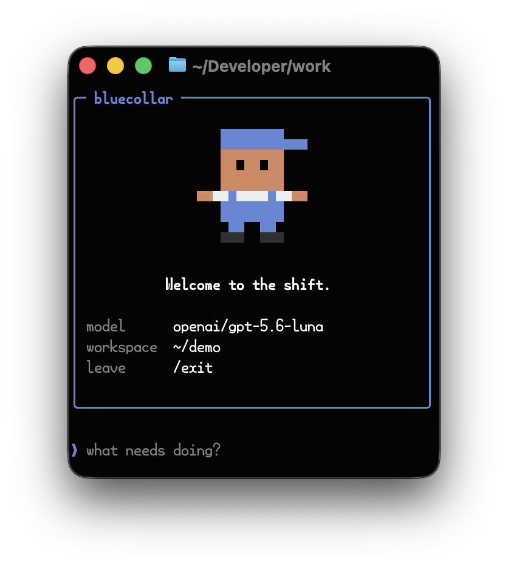

# bluecollar

*An agent harness that does the work, keeps a record, and tells you when it can't.*

[](https://github.com/yeomyeonggeori/bluecollar/actions/workflows/check.yml)
[](https://pkg.go.dev/github.com/yeomyeonggeori/bluecollar)
[](go.mod)
[](LICENSE)



> **Status: pre-alpha.** The exported API, the contract types and the event names change without notice. If you import it, pin a commit.

bluecollar is a headless, embeddable Go agent harness for unattended work. A host hands it a tool set and a task store; it runs the turn, proves completion from its own event ledger, and reports failure to the person who asked. Every tool call executes back in the host.

```bash
go build ./...
go test ./...
(cd cmd/bluecollar-acp && go test ./...)
OLLAMA_CONTEXT_LENGTH=32768 ollama serve &
ollama pull qwen3.5:4b
go run ./cmd/bluecollar --model qwen3.5:4b "In one sentence, what is a POSIX user?"
```

The documentation is [DOCS.md](DOCS.md), published at [bluecollar.intern.kim](https://bluecollar.intern.kim).

| path | holds |
|---|---|
| `.dependency/blueprotocol/` | the contract packages `agentcontract`, `toolcontract`, `model`, `taskstate`, `holdrecord`, `acpupdate` and `evaltest`, shared with the host as the blueprotocol submodule |
| `turnclassification/` | the names and normalization of a turn's route, task shape, task level and deliverable, shared by `intake` and `loop` |
| `iterationcost/` | what one iteration costs, the patience a model call is given and the budget profile of each task level |
| `turnclock/` | the turn's clock, which stops while an approval waits on the requester |
| `llmcalls/` | the schema names of the model calls bluecollar makes |
| `toolexposure/` | how many tools a plan step is expected to expose |
| `messageimages/` | the image parts of a message |
| `contextdescription/` | the prompt text that describes the active goal and the prior task |
| `decisionconfig/` | the decision model, configured from `BLUECOLLAR_DECISION_ENDPOINT`, `BLUECOLLAR_DECISION_API_KEY` and `BLUECOLLAR_DECISION_MODEL` |
| `model/tape/` | recording and replaying model calls |
| `loop/` | the agent loop |
| `intake/` | the turn router and the decision planner |
| `turnstream/`, `trace/` | a live view of a turn's ledger, and one run rendered as a file |
| `bench/` | run metrics, a harness runner, and the Terminal-Bench adapter |
| `cmd/bluecollar/` | the command-line runner |
| `acpagent/` | the loop as an importable Agent Client Protocol agent |
| `cmd/bluecollar-acp/` | the binary around `acpagent`, in its own module |
| `docs/` | the documentation site, generated from `DOCS.md` |

## Contributing

Pull requests open at alpha. Issues are welcome now: a decision you disagree with is the most useful one. [AGENTS.md](AGENTS.md) has the repository's conventions.

## License

Apache License 2.0. See [LICENSE](./LICENSE).
